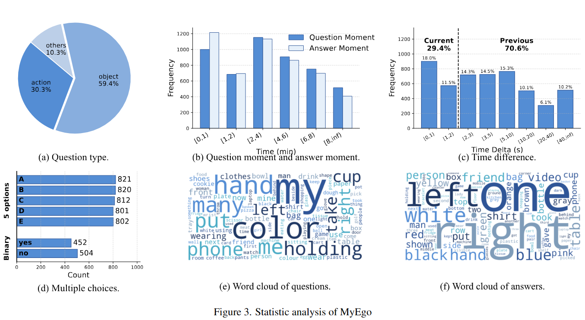

# MyEgo

## Overview
- 541 videos collected from 3 egocentric video dataset.
- 5,012 manually annotated questions, each with open-ended (OE) and multiple-choice (MC) subtasks.
  - **Personalized**: highlighting distinctions between the camera wearer's (*my*) actions or objects and those of others, compelling the model to engage in personalized reasoning to first determine "which one is mine?" before arriving at a correct answer.
- Highly challenging, even top models such as GPT-5 achieve only 46% accuracy, significantly falling behind human performance (85%).

## Dataset access
1. **Download the videos:** You can download the videos from [here](https://drive.google.com/drive/u/0/folders/1rZo-6X_Xst_9J9TzJOJ1owW3ZWUstOMl). Our videos are sourced from [Ego4D](https://ego4d-data.org/docs/data/videos), [CASTLE](https://castle-dataset.github.io/#download) and [Egolife](https://huggingface.co/datasets/lmms-lab/EgoLife).

2. **Video preprocessing:** You shall need to preprocess the videos collected from **Egolife** to remove the timestamp watermark.
```bash
python mask.py --input_folder <path_to_videos> --output_folder <path_to_save_unmasked_videos>
```
3. **Obtain QA files:** Please see `data/myego.json` for the QA files.
  
## Evaluation Pipeline

- Inference
Inference with one NVIDIA A100-SXM4-80GB GPU and batch size of 1 by default. We take `Qwen3-VL` as an example.
```bash
python inference.py --model_path <path_to_MLLM> --video_dir <path_to_videos> --qa_json data/myego.json --qa_format <oe/mc>
```

- GPT-based evaluation
```bash
export OPENAI_API_KEY=<your_api_key>
python eval.py
```

## Dataset Features

**Dataset Statistics**




**Comparion to existing egocentric video QA dataset**


## Evaluation Result
- Evaluation results of both open-source and closed-source MLLMs on MyEgo. (MC: Multiple-choice QA, OE: Open-Ended QA)

| Methods | MC-2 | MC-5 | MC-Cur. | MC-Pre. | MC-Avg. | OE-Action | OE-Object | OE-Others | OE-Cur. | OE-Pre. | OE-Avg. |
| :--- | :---: | :---: | :---: | :---: | :---: | :---: | :---: | :---: | :---: | :---: | :---: |
| **_Closed-source Models_** | | | | | | | | | | | |
| GPT-5 | 64.5 | 54.2 | 57.5 | 55.9 | 56.3 | 50.0 | 44.6 | 43.1 | 51.1 | 44.0 | 46.1 |
| Gemini-2.5 Pro | 60.3 | 45.1 | 49.9 | 47.5 | 48.2 | 40.2 | 40.2 | 47.7 | 42.4 | 40.3 | 40.9 |
| **_General Open-source Models_** | | | | | | | | | | | |
| _Parameters > 10B_ | | | | | | | | | | | |
| Qwen3-VL-32B-Instruct | 58.3 | 35.4 | 44.1 | 38.4 | 40.0 | 41.4 | 36.4 | 37.8 | 40.0 | 37.3 | 38.1 |
| Qwen3-VL-32B-Thinking | 55.2 | 37.9 | 44.3 | 40.0 | 41.3 | 40.1 | 35.5 | 35.8 | 40.6 | 35.4 | 36.9 |
| InternVL3.5-38B-Thinking | 54.6 | 41.8 | 43.8 | 44.6 | 44.4 | 35.5 | 34.8 | 37.8 | 35.2 | 35.3 | 35.3 |
| Qwen2.5-VL-32B-Instruct | 49.3 | 31.4 | 42.9 | 31.9 | 35.0 | 39.7 | 33.6 | 30.5 | 36.8 | 34.5 | 35.1 |
| InternVL3.5-38B-Instruct | 56.3 | 39.0 | 41.9 | 42.7 | 42.5 | 35.0 | 34.1 | 37.8 | 34.3 | 34.9 | 34.7 |
| InternVL3-38B | 51.3 | 41.9 | 44.1 | 43.7 | 43.8 | 35.7 | 32.5 | 39.1 | 33.3 | 34.5 | 34.1 |
| _4B < Parameters ≤ 10B_ | | | | | | | | | | | |
| Qwen2-VL-7B-Instruct | 54.3 | 29.6 | 36.5 | 33.9 | 34.6 | 34.6 | 36.3 | 35.1 | 35.8 | 35.6 | 35.7 |
| Qwen3-VL-8B-Instruct | 55.7 | 35.5 | 44.4 | 37.7 | 39.6 | 37.0 | 35.6 | 28.5 | 36.3 | 34.9 | 35.3 |
| InternVL3-8B | 53.6 | 38.8 | 41.0 | 42.1 | 41.8 | 31.9 | 36.3 | 36.4 | 35.6 | 34.8 | 35.0 |
| Qwen2.5-VL-7B-Instruct | 53.3 | 32.5 | 43.6 | 34.0 | 36.7 | 34.6 | 35.0 | 31.1 | 37.7 | 33.2 | 34.5 |
| LLaVA-Video | 52.3 | 33.8 | 42.7 | 35.5 | 37.5 | 33.9 | 33.9 | 39.7 | 36.3 | 33.7 | 34.5 |
| Qwen3-VL-8B-Thinking | 55.3 | 31.2 | 40.8 | 34.2 | 36.0 | 34.1 | 34.1 | 31.8 | 38.4 | 32.0 | 33.9 |
| MiniCPM-V 4.5 | 50.3 | 35.8 | 41.2 | 37.8 | 38.7 | 35.2 | 32.2 | 37.1 | 34.3 | 33.3 | 33.6 |
| LongVU | 56.0 | 31.9 | 40.3 | 35.3 | 36.7 | 31.9 | 33.1 | 36.4 | 30.8 | 34.0 | 33.1 |
| InternVL3.5-8B-Thinking | 52.0 | 36.3 | 42.7 | 38.2 | 39.5 | 31.1 | 33.9 | 34.4 | 33.8 | 32.8 | 33.1 |
| LLaVA-OV-7B | 49.7 | 32.7 | 40.8 | 34.3 | 36.1 | 31.1 | 32.4 | 38.4 | 33.8 | 32.1 | 32.6 |
| LongVA | 56.3 | 28.6 | 39.6 | 32.1 | 34.2 | 33.9 | 31.0 | 29.8 | 34.7 | 30.5 | 31.7 |
| InternVL3.5-8B-Instruct | 55.6 | 35.5 | 41.2 | 38.9 | 39.6 | 32.4 | 26.8 | 27.2 | 31.5 | 27.3 | 28.5 |
| InternVL2.5-8B | 50.3 | 35.3 | 41.2 | 37.2 | 38.3 | 27.5 | 21.9 | 19.2 | 27.2 | 21.8 | 23.3 |
| _Parameters ≤ 4B_ | | | | | | | | | | | |
| Qwen3-VL-4B-Instruct | 55.7 | 35.0 | 43.6 | 37.4 | 39.2 | 36.1 | 35.6 | 35.8 | 37.4 | 35.1 | 35.8 |
| Qwen3-VL-4B-Thinking | 55.3 | 29.6 | 39.1 | 33.1 | 34.7 | 37.0 |33.5 | 29.8 | 37.2 | 33.0 | 34.2 | 
| InternVL3.5-4B-Thinking | 48.3 | 36.8 | 41.7 | 38.1 | 39.1 | 32.8 | 31.0 | 35.8 | 32.4 | 31.8 | 32.0 |
| InternVL3.5-4B-Instruct | 49.0 | 31.1 | 36.7 | 34.0 | 34.7 | 28.6 | 30.7 | 30.5 | 30.6 | 29.9 | 30.1 |
| Qwen2.5-VL-3B-Instruct | 54.0 | 28.7 | 38.8 | 31.8 | 33.8 | 29.3 | 29.8 | 30.5 | 28.1 | 30.4 | 29.7 |
| **_Memory-Enhanced Streaming QA Methods_** | | | | | | | | | | | |
| Flash-VStream (Qwen2-VL-7B) | 51.3 | 31.1 | 36.3 | 34.8 | 35.2 | 31.9 | 29.9 | 35.1 | 31.5 | 30.8 | 31.0 |
| Dispider (Qwen2-VL-7B) | 45.5 | 31.2 | 31.9 | 33.1 | 32.7 | - | - | - | - | - | - |

- Visualization of the evaluation results


## License
For the video sources, please refer to the original dataset licenses: 
- [Ego4D](https://ego4ddataset.com/ego4d-license/)
- [CASTLE](https://castle-dataset.github.io)
- [Egolife](https://github.com/EvolvingLMMs-Lab/EgoLife/blob/main/LICENSE)
