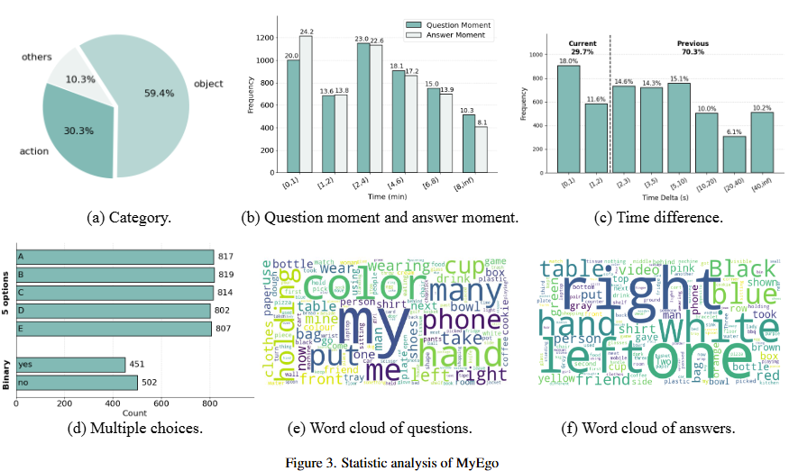
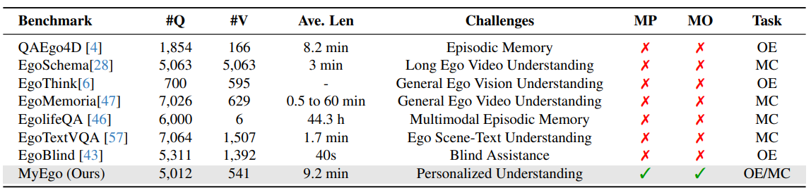
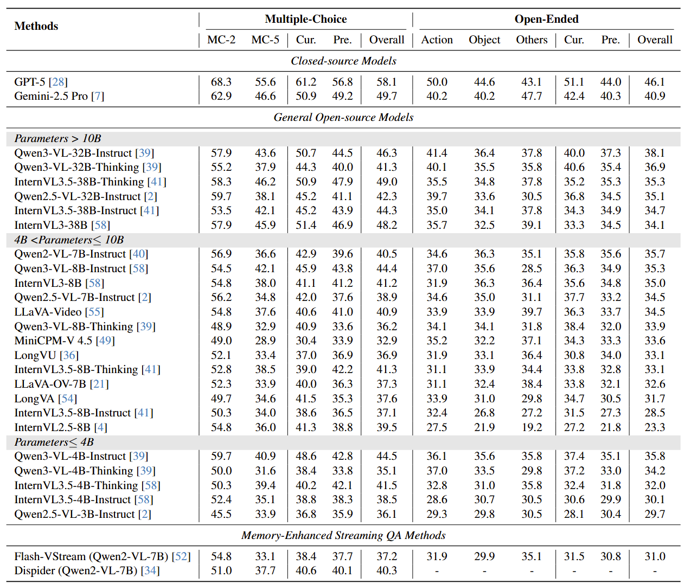
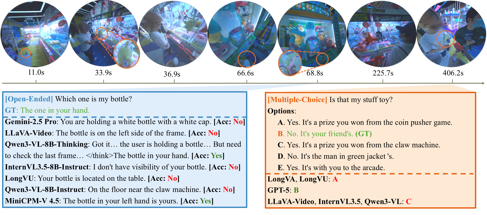

# MyEgo

## Overview
- 541 videos collected from 3 egocentric video dataset.
- 5,012 manually annotated questions, each with open-ended (OE) and multiple-choice (MC) subtasks.
  - **Personalized**: highlighting distinctions between the camera wearer's (*my*) actions or objects and those of others, compelling the model to engage in personalized reasoning to first determine "which one is mine?" before arriving at a correct answer.
- Highly challenging, even top models such as GPT-5 achieve only 46% accuracy, significantly falling behind human performance (85%).

**Datset Statistics**




**Comparion to existing egocentric video QA dataset**:


## Dataset access
1. **Download the videos:** We will release our video source and download scripts soon.
   <!-- You can download the video from [site](https://drive.google.com/drive/u/0/folders/1rZo-6X_Xst_9J9TzJOJ1owW3ZWUstOMl) -->
2. **Video preprocessing:** You shall need to preprocess the videos collected from **Egolife** to remove the timestamp watermark.
```bash
python scripts/mask.py --input_folder <path_to_videos> --output_folder <path_to_save_unmarked_videos>
```
1. **Obtain QA files:** Please see `data/myego.json` for the QA files.

## Evaluation Result
- Evaluation results of both open-source and closed-source MLLMs on MyEgo



- Visualization of the evaluation results




## Evaluation Pipeline
- Inference
To be released soon.
- GPT-based evaluation
To be released soon.

## License
For the video sources, please refer to the original dataset licenses: 
- [Ego4D](https://ego4ddataset.com/ego4d-license/)
- [CASTLE](https://castle-dataset.github.io)
- [Egolife](https://github.com/EvolvingLMMs-Lab/EgoLife/blob/main/LICENSE)
